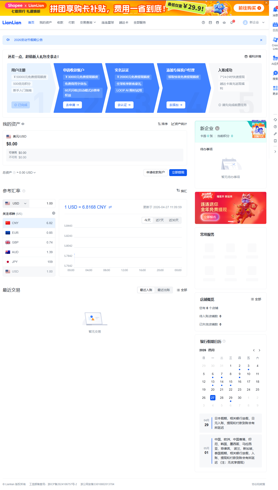

# Demo Evidence Pack

This page is the interview-facing proof that the project is more than a code demo. It shows:

- a stable CLI entrypoint
- a reproducible artifact contract
- a structured planning output
- a real browser-run screenshot
- the Allure opening behavior after UI execution

## Recommended Commands

Validate the requirement-to-plan pipeline without browser execution:

```bash
python main_v2.py validate --requirement-file examples/benchmarks/benchmark_list_search.md
```

Run an official benchmark case:

```bash
python main_v2.py demo --demo-case login-success --no-ui
```

Run the full UI flow and auto-open Allure at the end:

```bash
python main_v2.py run --requirement-file examples/requirement_login_only.md
```

If UI execution happens successfully, the CLI will try to generate and open the Allure report automatically. Use `--no-open-report` when you want to suppress that behavior.

## Local Credential Input

For local private login runs, the easiest credential format is:

```md
## Credentials
- identifier: your_login_identifier
- password: your_login_password
```

If the requirement file does not include plaintext credentials, the runner falls back to `.env` values such as `LOGIN_USERNAME` and `LOGIN_PASSWORD`.

Official repository examples keep placeholders only and do not commit real credentials.

## Stable Outputs

Every run writes a fixed contract under `output/runs/<run_id>/`:

- `requirements.json`
- `test_strategy.json`
- `test_cases.json`
- `review.json`
- `script_plan.json`
- `execution.json`
- `run_summary.json`
- `run_manifest.json`

This is the main signal that the project is platform-like rather than a one-off script.

## Example Run Summary

Excerpt from an offline smoke benchmark run:

```json
{
  "run_id": "20260427_112728",
  "benchmark_case": {
    "id": "list-search",
    "name": "List Search Path"
  },
  "requirement_count": 1,
  "test_case_count": 1,
  "review_score": 100,
  "planned_script_count": 1,
  "execution_target_counts": {
    "playwright_native": 1
  },
  "execution_status": "skipped",
  "failure_category": "none"
}
```

## Example Script Plan

Excerpt from `script_plan.json`:

```json
{
  "script_plans": [
    {
      "testcase_id": "TC_SMOKE_001",
      "title": "Offline smoke case",
      "scenario": {
        "scenario_type": "generic",
        "execution_policy": "native_first"
      },
      "steps": [
        {
          "step_number": 1,
          "preferred_executor": "playwright_native",
          "action_prompt": "Validate CLI artifact contract",
          "verify_prompt": "Stable files are written"
        }
      ]
    }
  ]
}
```

This is the key "smartness" artifact to show in an interview, because it makes the planner's decision visible instead of hiding it inside code.

## Real Run Screenshot

Final screenshot captured from a successful bounded login browser run:



This screenshot is intentionally kept as supporting evidence that the project can reach a real browser end state, not just emit JSON and TypeScript.

The Allure HTML output is still treated as a runtime artifact instead of a committed static file, so the repository stays clean while the UI run can still auto-open the report locally.
